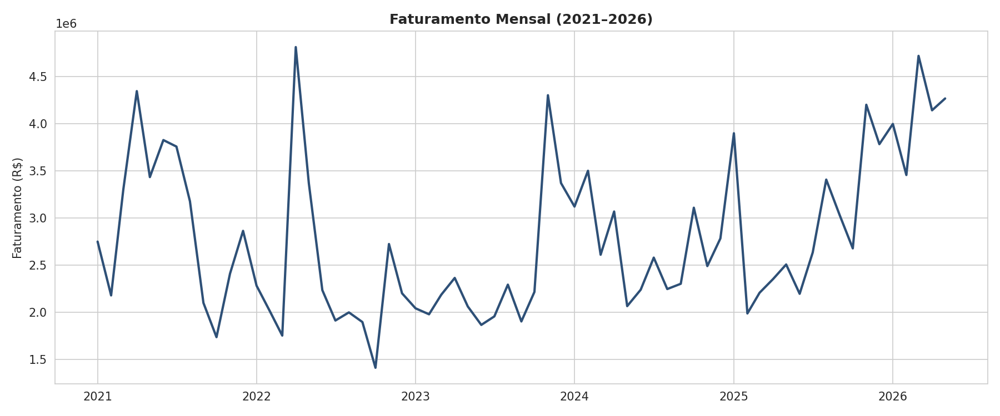
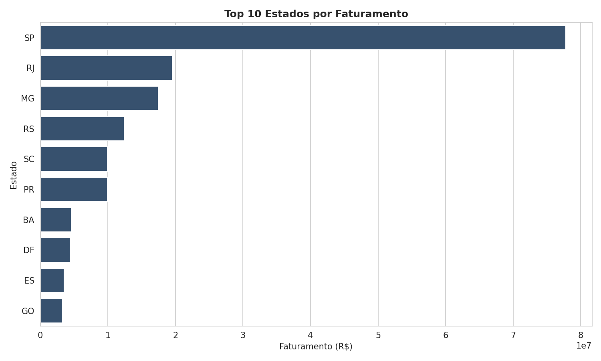
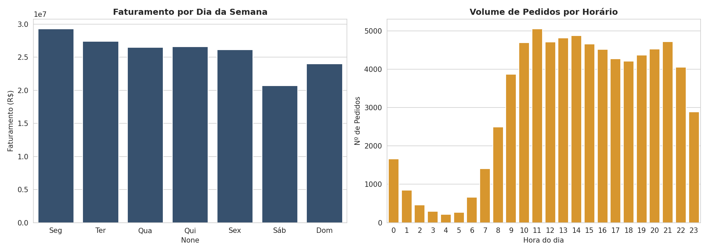
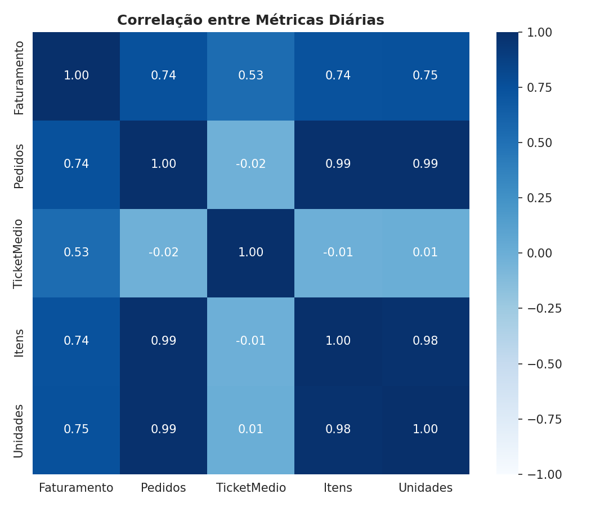
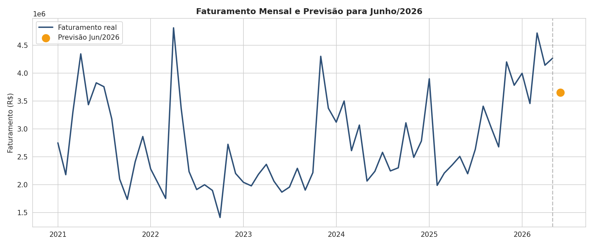

# Análise de Dados - Ecommerce

# 1. Problema de Negócio

> ⚠️ Este projeto utiliza um conjunto de dados simulados/modificados, sem correspondência com informações reais.

A ShopOnline é uma loja virtual que vende para todo o território nacional. Nos últimos meses, a diretoria notou oscilações no número de pedidos e no faturamento e quer entender melhor o que está acontecendo com o negócio antes de planejar o próximo trimestre.

Para isso, a diretoria solicitou uma análise detalhada dos pedidos da loja para responder às seguintes perguntas:

1. Como está a saúde do negócio, no geral?
2. Existe algum motivo do porquê o faturamento sobe ou cai?
3. Previsão de faturamento de Junho a Dezembro de 2026.
4. Recomendações para alavancar ainda mais o negócio.

# 2. Ferramentas Utilizadas

**Ferramentas para Análise de Dados**

- Excel
- Python (Pandas, NumPy)
- Visualização de Dados (Matplotlib, Seaborn)
- Estatística Descritiva e Análise de Correlação
- Regressão Linear e Decomposição de Série Temporal (Scikit-learn)

**Habilidades e Abordagem:**

- Pensamento Crítico e Resolução de Problemas: habilidades fundamentais aplicadas para analisar, solucionar problemas e tomar decisões ao longo do projeto.

# 3. Descrição dos Dados

| Campo | Descrição |
| --- | --- |
| Cidade | Cidade onde o pedido foi realizado |
| Estado | UF da cidade do pedido |
| Data | Data em que o pedido foi realizado |
| Hora | Horário em que o pedido foi realizado |
| Total | Valor total do pedido (R$) |
| Status Pedido | Status do pedido |
| Qtd. Itens | Quantidade de itens distintos no pedido |
| Qtd. Unidades | Quantidade total de unidades compradas no pedido |

Base com **74.527 pedidos**, cobrindo o período de **01/01/2021 a 31/05/2026**, distribuídos em **27 estados** e mais de 3.400 cidades.

## 3.1 Premissas Assumidas:

- Cada linha do arquivo já representa um pedido único, sem necessidade de agrupamento.
- Todos os registros têm status "Aprovado", ou seja, a base reflete apenas vendas concluídas — não há, nesta base, visão sobre pedidos cancelados ou recusados.
- Os valores monetários estavam no formato brasileiro (`1.234,56`) e foram convertidos para float padrão antes da análise.

# 4. Descrição da Solução

Para atender às demandas da diretoria, foram realizadas quatro tipos distintos de análise: Descritiva, Diagnóstica, Preditiva e Prescritiva, seguindo o método **SAPE** (Situação, Análise, Plano e Execução), de forma organizada e orientada aos objetivos de negócio definidos.

O notebook completo com todo o código está em [`analise_vendas.ipynb`](analise_vendas.ipynb).

# 5. Análise Descritiva

## 5.1 Ao longo do tempo

- O faturamento caiu fortemente em 2022 (**-20,3%**) frente a 2021, ficou praticamente estável em 2023 e vem em recuperação desde então: **+12,5%** em 2024 e **+8,6%** em 2025.
- Os 5 primeiros meses de 2026 somam **R$ 20,6 milhões** — se mantido o ritmo, 2026 fecharia como o melhor ano da série histórica.
- Importante: o **número de pedidos vem caindo** ano a ano desde 2021 (17.345 pedidos em 2021), enquanto o **ticket médio sobe** (de R$ 2.068 em 2021 para a faixa de R$ 2.400–2.850 nos anos seguintes). O crescimento recente de faturamento é puxado por ticket médio maior, não por mais pedidos.

## 5.2 Estado

- São Paulo concentra, isoladamente, **43,1%** de todo o faturamento da ShopOnline.
- Os 5 maiores estados (SP, RJ, MG, RS, SC) somam **~76%** das vendas — alta concentração geográfica, que representa tanto uma força (mercados consolidados) quanto um risco (dependência de poucas regiões).

## 5.3 Sazonalidade

- O **sábado** é o dia de menor faturamento da semana (queda de cerca de 25% frente aos dias úteis); o domingo já recupera parte do movimento.
- O volume de pedidos cresce a partir das 8h, mantém-se em um platô elevado entre 10h e 21h, e cai abruptamente após as 22h.

# 6. Análise Diagnóstica

## 6.1 Hipóteses

### H1. Quanto maior o número de pedidos no dia, maior o faturamento do dia.

**Aceita:** correlação de **0,74** entre número de pedidos e faturamento diário — forte relação positiva.

### H2. Quanto maior o ticket médio do dia, maior o faturamento do dia.

**Aceita parcialmente:** correlação de **0,53** entre ticket médio e faturamento diário — existe relação, mas mais fraca do que a do volume de pedidos.

### H3. O crescimento de faturamento recente vem do aumento no número de pedidos.

**Rejeitada:** o número de pedidos por ano vem caindo desde 2021, enquanto o faturamento anual está em recuperação. O crescimento recente é explicado pelo aumento do ticket médio, e não pelo volume de pedidos.

### H4. O faturamento está concentrado em poucos estados.

**Aceita:** São Paulo isolado responde por 43,1% do faturamento; os 5 maiores estados somam ~76%.

### H5. O fim de semana tem desempenho pior que os dias úteis.

**Aceita parcialmente:** sábado é claramente o dia mais fraco da semana; domingo já se aproxima da média dos demais dias.

## 6.2 Resultado

- O faturamento diário está mais relacionado ao volume de pedidos (0,74) do que ao ticket médio (0,53).
- Apesar disso, o crescimento de faturamento *ano a ano* mais recente foi puxado pelo ticket médio, já que o volume anual de pedidos vem encolhendo desde 2021.
- O negócio é fortemente concentrado em São Paulo e apresenta sazonalidade clara por dia da semana e horário.

# 7. Análise Preditiva

Para construir o modelo de Série Temporal (a nível mensal, já que o volume diário é muito ruidoso para este negócio), foram realizados os seguintes passos:

## 7.1 Encontrar a Sazonalidade + Erro

1. A granularidade utilizada foi mensal (MM/AAAA).
2. Utilizada uma média móvel centralizada com janela de 12 meses para suavizar a curva de faturamento.
3. Dividido o faturamento pela média móvel para encontrar a Sazonalidade com erro embutido, tirando a média por mês do calendário (Jan, Fev, ..., Dez).

## 7.2 Encontrar a Tendência

1. Desazonalizado o faturamento: Faturamento Real / Sazonalidade do mês.
2. Treinado modelo com Regressão Linear sobre os últimos 24 meses desazonalizados para encontrar a tendência.
3. Projetada a mesma reta de tendência 7 passos à frente (1 para cada mês de junho a dezembro/2026), aplicando a sazonalidade correspondente a cada mês do calendário.

## 7.3 Resultado Final

- Previsão = Tendência × Sazonalidade do mês, calculada mês a mês de junho a dezembro/2026.
  
| Mês | Previsão | Intervalo (±18,2%) |
| --- | --- | --- |
| Jun/2026 | R$ 3.650.157,08 | R$ 2.984.266,65 a R$ 4.316.047,50 |
| Jul/2026 | R$ 3.830.624,00 | R$ 3.131.811,38 a R$ 4.529.436,61 |
| Ago/2026 | R$ 3.970.095,04 | R$ 3.245.839,02 a R$ 4.694.351,07 |
| Set/2026 | R$ 3.445.750,59 | R$ 2.817.149,61 a R$ 4.074.351,57 |
| Out/2026 | R$ 3.461.524,82 | R$ 2.830.046,18 a R$ 4.093.003,46 |
| Nov/2026 | R$ 5.100.743,09 | R$ 4.170.225,33 a R$ 6.031.260,84 |
| Dez/2026 | R$ 4.799.153,50 | R$ 3.923.654,09 a R$ 5.674.652,90 |
| **Total (Jun–Dez)** | **R$ 28.258.048,11** | **R$ 23.102.992,27 a R$ 33.413.103,95** |

- Novembro e dezembro aparecem como os meses de maior faturamento previsto, puxados pela sazonalidade de fim de ano (Black Friday e Natal).

### 7.3.1 Erro do Modelo

- MAPE (últimos 12 meses, validação): **18,2%**
- O erro passou a ser medido sobre 12 meses para cobrir um ciclo sazonal completo, a janela mais longa expõe o modelo a mais variação sazonal, em vez de só aos meses recentes "mais fáceis".
- Logo, cada previsão mensal, e também o total do período, tem um erro embutido de aproximadamente 18,2% para mais ou menos, conforme os intervalos na tabela acima.

# 8. Análise Prescritiva

## 8.1 Recomendações

1. **Atacar a queda no volume de pedidos.** O faturamento recente cresce por ticket médio, não por volume — e o volume de pedidos é a variável mais correlacionada ao faturamento diário (r=0,74). Recuperar o número de pedidos (marketing, aquisição, recompra) tem potencial de acelerar ainda mais o crescimento.
2. **Reduzir a dependência de São Paulo.** Com 43% do faturamento concentrado em um único estado, investir em campanhas regionais para Sul e Nordeste (hoje com participação ainda baixa) pode diversificar a receita e reduzir o risco de concentração geográfica.
3. **Reforçar o sábado com ações comerciais.** É o dia de pior desempenho relativo — promoções ou frete grátis específicos para sábado podem nivelar o faturamento ao longo da semana.
4. **Aproveitar a janela de pico (10h–21h).** Concentrar comunicação, anúncios pagos e disponibilidade de atendimento nesse intervalo, já que é onde está a maior parte da demanda.
5. **Monitorar o ticket médio como alavanca de curto prazo**, mas sem depender só dele: ele tem menor correlação com o faturamento diário (0,53) do que o volume de pedidos, funcionando melhor como complemento do que como motor principal de crescimento.
6. **Preparar estoque, logística e time comercial para o pico de novembro–dezembro.** A previsão aponta novembro e dezembro/2026 como os meses de maior faturamento do semestre (Black Friday e Natal) — vale antecipar compras de estoque, reforço de equipe e capacidade de entrega para não perder vendas por ruptura ou atraso.

# 9. Resultado Final

A ShopOnline atravessou uma retração em 2022 e está em trajetória de recuperação desde 2024, puxada principalmente pelo aumento do ticket médio — enquanto o volume de pedidos ainda não voltou aos níveis de 2021. O negócio é fortemente concentrado em São Paulo e apresenta sazonalidade clara por dia da semana e horário. A previsão para o segundo semestre de 2026 (junho a dezembro) indica continuidade do crescimento, somando aproximadamente **R$ 28,26 milhões** no período (±18,2%), com novembro e dezembro se destacando como os meses de maior faturamento por conta da sazonalidade de fim de ano. As recomendações práticas miram especificamente recuperar o volume de pedidos, diversificar a base geográfica e preparar a operação para o pico de fim de ano, que são os pontos de maior risco e maior oportunidade identificados na análise.
